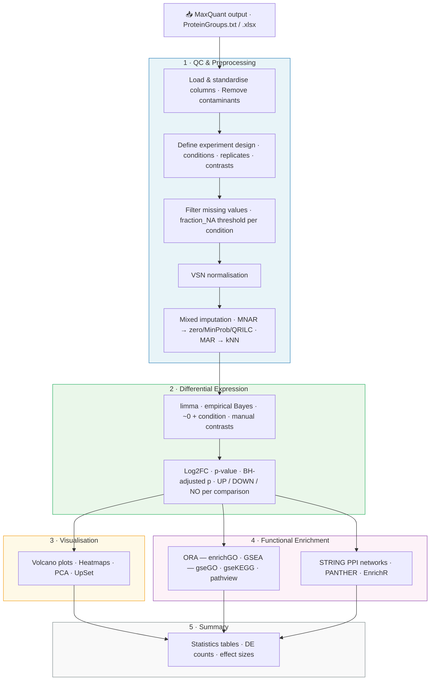
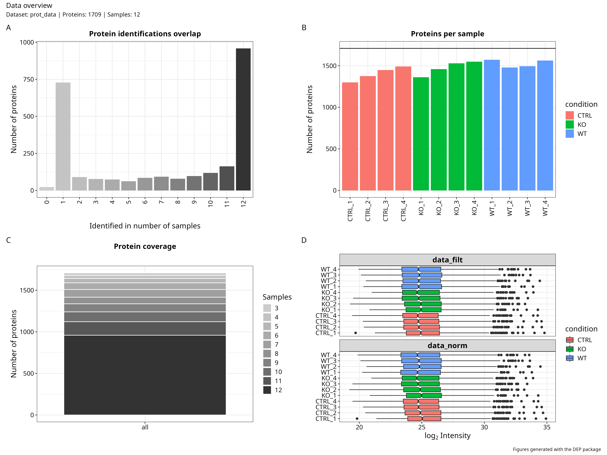
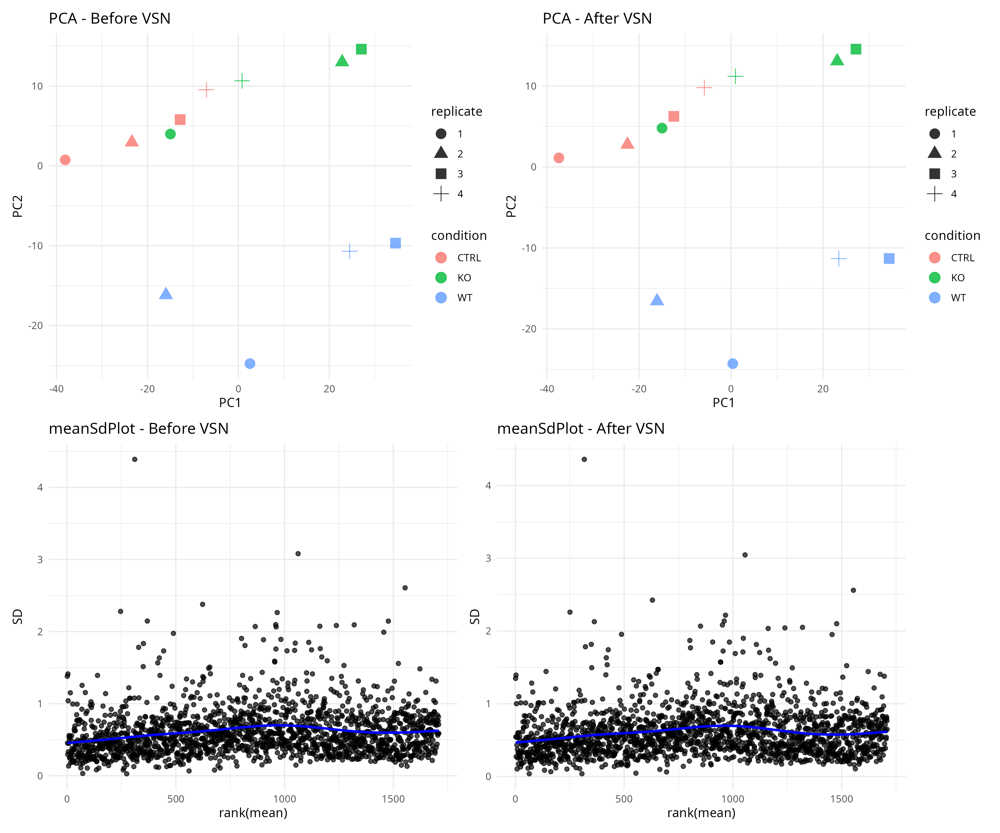
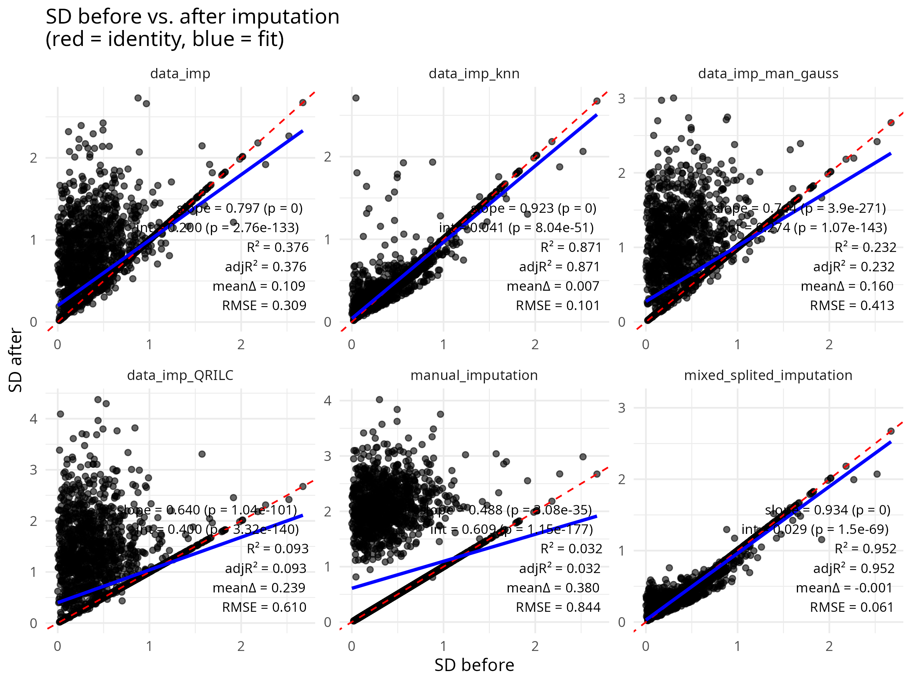
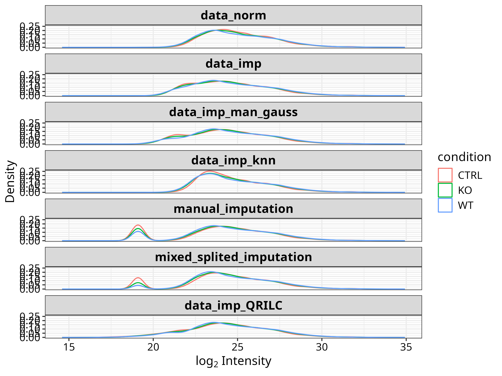
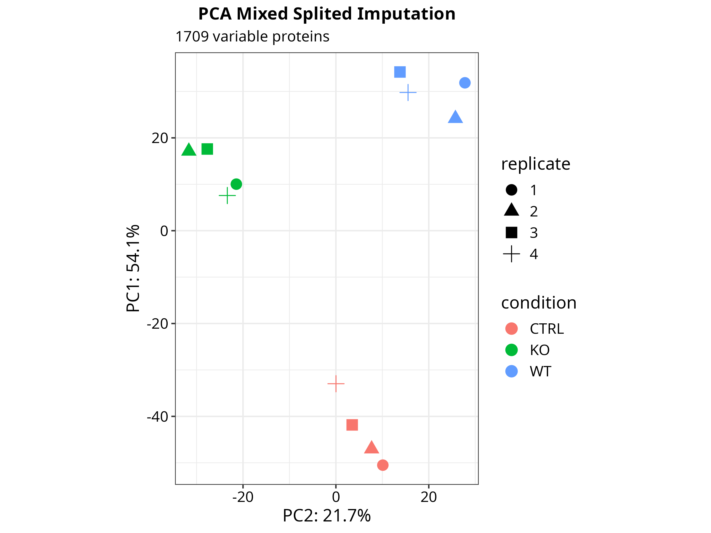
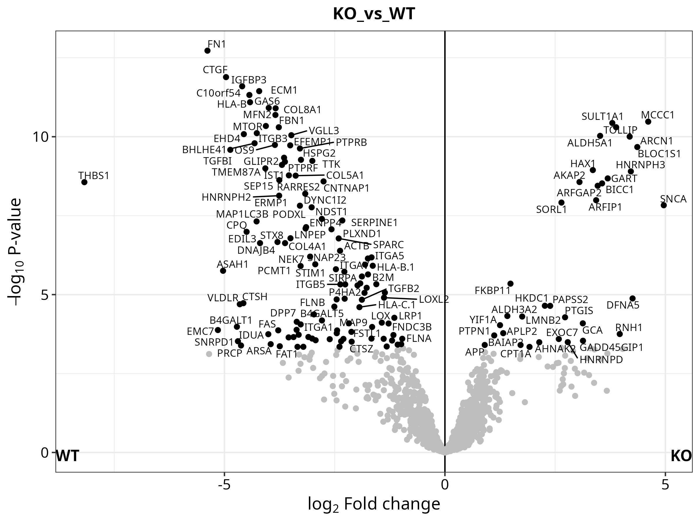
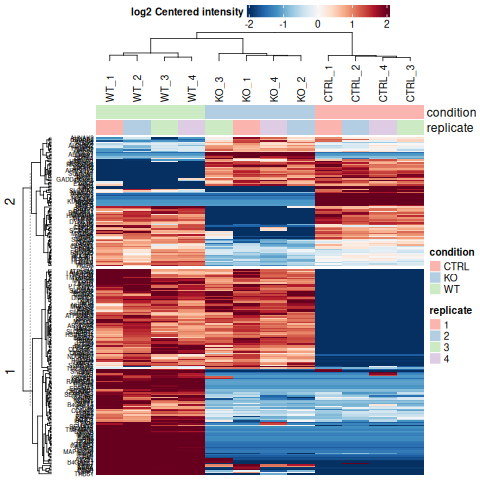
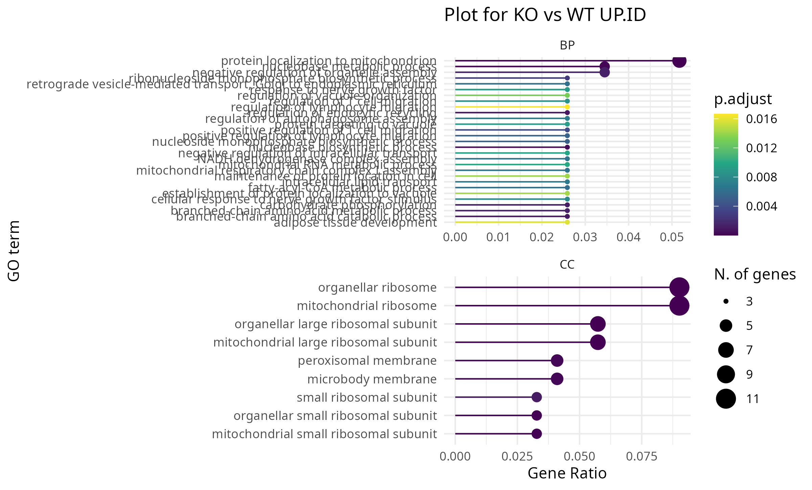

# Proteomics Analysis Pipeline

[](https://www.gnu.org/licenses/gpl-3.0) [](https://www.r-project.org/) [](https://bioconductor.org/)

A modular and reproducible R pipeline for label-free quantitative (LFQ) proteomics data analysis. Designed to process MaxQuant output from Orbitrap and Q-Exactive mass spectrometers, covering the complete workflow from raw protein groups to functional enrichment.

## Pipeline Overview


```mermaid
flowchart TD
    A["📥 MaxQuant output · ProteinGroups.txt / .xlsx"] --> B

    subgraph QC ["1 · QC & Preprocessing"]
        B["Load & standardise columns · Remove contaminants"]
        B --> C["Define experiment design · conditions · replicates · contrasts"]
        C --> D["Filter missing values · fraction_NA threshold per condition"]
        D --> E["VSN normalisation"]
        E --> F["Mixed imputation · MNAR → zero/MinProb/QRILC · MAR → kNN"]
    end

    subgraph DE ["2 · Differential Expression"]
        F --> G["limma · empirical Bayes · ~0 + condition · manual contrasts"]
        G --> H["Log2FC · p-value · BH-adjusted p · UP / DOWN / NO per comparison"]
    end

    subgraph VIZ ["3 · Visualisation"]
        H --> I["Volcano plots · Heatmaps · PCA · UpSet"]
    end

    subgraph ENRICH ["4 · Functional Enrichment"]
        H --> J["ORA — enrichGO · GSEA — gseGO · gseKEGG · pathview"]
        H --> K["STRING PPI networks · PANTHER · EnrichR"]
    end

    subgraph SUMM ["5 · Summary"]
        I & J & K --> L["Statistics tables · DE counts · effect sizes"]
    end

    style QC fill:#e8f4f8,stroke:#2980b9
    style DE fill:#eaf7ea,stroke:#27ae60
    style VIZ fill:#fef9e7,stroke:#f39c12
    style ENRICH fill:#fdf2f8,stroke:#8e44ad
    style SUMM fill:#f9f9f9,stroke:#7f8c8d
```

## Repository Structure

```         
Proteomics/
├── code/                   # Modular R scripts (the pipeline)
│   ├── 00_packages.R              # Package management (CRAN + Bioconductor)
│   ├── 01_loading_data.R          # Data loading & contaminant removal
│   ├── 02_Experiment_design.R             # Experimental design matrix definition
│   ├── 03_cleaning_data_mixed_imputation.R  # Filtering, normalization, imputation
│   ├── 04_data_analysis.R         # Differential expression (limma/DEP)
│   ├── 05_Plots.R                 # Volcano plots, heatmaps, barplots
│   ├── 06_GO.R                    # Gene Ontology enrichment (enrichGO)
│   ├── 07_Strings.R               # STRING protein interaction networks
│   ├── 08_gseGO.R                 # Gene Set Enrichment (GO)
│   ├── 09_gseKEGG.R               # Gene Set Enrichment (KEGG)
│   ├── 10_RBioApi_string.R        # String protein interaction networks using RBioApi library https://rbioapi.moosa-r.com/ doi:10.1093/bioinformatics/btac172.
│   ├── 11_RBioApi_panther.R       # Gene Ontology analysis using Panther through RBioApi library https://rbioapi.moosa-r.com/ doi:10.1093/bioinformatics/btac172.
│   ├── 12_pca_plots.R             # PCA visualization
│   ├── 13_GO_padj.R               # Gene Ontology enrichment (enrichGO) only for adjusted p-values significant proteins
│   ├── 14_gseKEGG_padj.R          # Gene Set Enrichment (KEGG) only for adjusted p-values significant proteins
│   ├── 15_gseGO_adj.R             # Gene Set Enrichment (GO) only for adjusted p-values significant proteins
│   ├── 16_venn_diagram.R          # Venn / UpSet diagrams
│   ├── 17_summary_stats_proteomics.R #Summary statistics
│   ├── 18_EnrichR.R               # EnrichR analysis
│   └── global_variables.R         # Thresholds, paths, helper functions
│
├── mains/                  # RMarkdown entry points (one per dataset)
│   └── IP-CLN3_PXD031582.Rmd     # CLN3 interactome analysis (mouse)
│
├── docs/                   # Documentation
├── rawdata/                # Input data (not tracked, see below)
├── output/                 # Generated results (not tracked)
├── LICENSE                 # GPL-3.0
└── README.md
```

## How It Works

Each analysis is driven by an **RMarkdown file** in `mains/` that:

1.  Sets organism-specific parameters (species, KEGG code, annotation DB)
2.  Defines the experimental design (samples, conditions, replicates, comparisons)
3.  Calls modular scripts from `code/` sequentially

This design allows reusing the same pipeline across different datasets and organisms by simply creating a new `.Rmd` file with the appropriate configuration.

### Supported Organisms

| Organism       | KEGG code | Species ID | Annotation DB  |
|----------------|-----------|------------|----------------|
| *Homo sapiens* | `hsa`     | 9606       | `org.Hs.eg.db` |
| *Mus musculus* | `mmu`     | 10090      | `org.Mm.eg.db` |
| *Danio rerio*  | `dre`     | 7955       | `org.Dr.eg.db` |

### Imputation Strategy

The pipeline implements a **mixed imputation** approach that handles:

-   **MNAR** (Missing Not At Random): proteins below detection limit → imputed with `zero`, `MinProb`, or `QRILC`
-   **MAR** (Missing At Random): randomly absent proteins → imputed with kNN

Configurable parameters: `fraction_NA`, `factor_SD_impute`, and `mnar_var`.

## Getting Started

### Prerequisites

-   R ≥ 4.3
-   Bioconductor ≥ 3.18
-   MaxQuant output (`proteinGroups.txt` or preferably exported `.xlsx`)

### Installation

``` r
# The pipeline manages its own dependencies via 00_packages.R
# Key packages: DEP, limma, clusterProfiler, ComplexHeatmap, rbioapi, enrichplot
source("code/00_packages.R")
```

### Running an Analysis

1.  Place your MaxQuant output in `rawdata/`
2.  Copy an existing `.Rmd` from `mains/` as a template
3.  Adjust organism parameters and experimental design
4.  Knit or run chunks sequentially

``` r
# Example: adjust these in your .Rmd
kegg_organism <- "dre"
species <- 7955
organism <- "org.Dr.eg.db"
comparisons <- c("CTRL_vs_WT", "CTRL_vs_KO", "KO_vs_WT")
```

### Output

Results are organized into:

```         
output/<experiment_name>/
├── tables/          # Excel files (results, experiment design, DEGs)
├── figures/         # Publication-ready plots (TIFF + PDF)
│   ├── enrichGO/
│   ├── gseGO/
│   ├── KEGG/
│   ├── panther/
│   └── rbioapi/
├── RData/           # Intermediate R objects
└── VennDiagram/     # Venn diagram outputs
```

## Key Parameters

| Parameter     | Default | Description                               |
|---------------|---------|-------------------------------------------|
| `p_val`       | 0.05    | Significance threshold                    |
| `p_val_low`   | 0.01    | Stringent significance threshold          |
| `FC`          | 0.5     | Log2 fold-change threshold                |
| `fraction_NA` | 0.6     | Max fraction of NAs allowed per condition |
| `keyType`     | UNIPROT | Identifier type for annotations           |

## Parameters Setup

The complete configuration lives in the **setup chunk** (lines ~30–120) of the `.Rmd` in `mains/`. Everything below that chunk runs automatically. See [`mains/readme.md`](mains/readme.md) for the full step-by-step guide; this section summarises the most error-prone settings.

### Path format — Windows vs Linux/macOS

> **This is the most common source of errors when moving a project between systems.**

R accepts forward slashes (`/`) on all platforms. Windows backslashes (`\`) must be escaped or converted:

```r
# ❌ Windows backslash — breaks on Linux/Mac, requires escaping on Windows
output_path <- "C:\Users\John\Proteomics\output\CLN3\"

# ✅ Forward slashes — works on all platforms
output_path <- "C:/Users/John/Proteomics/output/CLN3/"

# ✅ Linux / macOS
output_path <- "./output/CLN3/"
```

When working on Linux/macOS the recommended convention is **relative paths from the `mains/` directory**:

```r
output_path <- "./output/YourExperiment/"   # relative to mains/
prot_data   <- readxl::read_xlsx("../rawdata/ProteinGroups_YourExperiment.xlsx")
```

Use `file.exists(output_path)` and `file.exists(path_to_data)` to verify paths before knitting.

### Organism parameters

```r
kegg_organism <- "hsa"          # KEGG species code
species       <- 9606            # NCBI taxonomy ID
organism      <- "org.Hs.eg.db" # Bioconductor annotation package
```

| Organism | `kegg_organism` | `species` | `organism` |
|---|---|---|---|
| *Homo sapiens* | `"hsa"` | 9606 | `"org.Hs.eg.db"` |
| *Mus musculus* | `"mmu"` | 10090 | `"org.Mm.eg.db"` |
| *Danio rerio* | `"dre"` | 7955 | `"org.Dr.eg.db"` |

### Experimental design

```r
# label: exact LFQ column names from the MaxQuant ProteinGroups file
label <- c("LFQ intensity WT_1", "LFQ intensity WT_2",
           "LFQ intensity KO_1", "LFQ intensity KO_2")

# Short internal names — no spaces, no special characters
columns_to_rename <- c("WT_1", "WT_2", "KO_1", "KO_2")

# Group assignment — must align with label order
condition  <- as.factor(c("WT", "WT", "KO", "KO"))
replicate  <- c(1, 2, 1, 2)
experiment <- rep("MyExperiment", length(replicate))
```

### Comparisons

```r
# Each string must follow the pattern "ConditionA_vs_ConditionB"
# where both tokens exactly match levels in the `condition` factor above
comparisons <- c("KO_vs_WT")
```

---

## Example Dataset

The included `IP-CLN3_PXD031582.Rmd` analyzes a CLN3 lysosomal interactome dataset in human cells, comparing CTRL vs WT vs KO conditions (4 replicates each, 12 samples total). Raw data available at [ProteomeXchange PXD031582](https://www.ebi.ac.uk/pride/archive/projects/PXD031582). Original article: Calcagni’, A., Staiano, L., Zampelli, N. et al. Loss of the batten disease protein CLN3 leads to mis-trafficking of M6PR and defective autophagic-lysosomal reformation. Nat Commun 14, 3911 (2023). <https://doi.org/10.1038/s41467-023-39643-7>

## Dependencies

**CRAN**: tidyverse, writexl, ggrepel, ggpubr, pheatmap, rbioapi, eulerr, patchwork, RColorBrewer

**Bioconductor**: DEP, limma, clusterProfiler, enrichplot, ComplexHeatmap, biomaRt, pathview, STRINGdb, vsn, edgeR, topGO, rrvgo, DOSE, viridis

## Troubleshooting

### Path errors

**`Error in read_xlsx: cannot open the connection`** or **`No such file or directory`**

The most frequent cause when switching between Windows and Linux/macOS is a path separator mismatch.

```r
# Diagnose
file.exists("../rawdata/ProteinGroups_MyExp.xlsx")  # should return TRUE

# Fix: replace backslashes with forward slashes
# Windows path pasted from Explorer: "C:\Users\John\rawdata\file.xlsx"
# Corrected:                          "C:/Users/John/rawdata/file.xlsx"
```

On Linux/macOS, Windows drive letters (`C:/`) are not valid. Use relative paths (`./`, `../`) to keep analyses portable across systems.

**`Error: path does not exist`** after `output_path` is set

The output directory must exist before the pipeline writes to it. The `.Rmd` calls `dir.create(output_path, recursive = TRUE)` in the setup chunk — verify this line runs before any `ggsave()` or `write_xlsx()` call.

---

### R environment

**`Error: object 'kegg_organism' not found`**

The setup chunk has not been executed. In interactive mode run all chunks from the top in order (`Ctrl+Shift+Enter`). When knitting, this error indicates that the setup chunk label is not `setup` — RMarkdown auto-runs a chunk labelled `setup` first; all others require sequential execution.

**`renv::restore()` fails on Bioconductor packages**

```r
BiocManager::install(version = "3.18")  # set correct release first
renv::restore()
```

If individual packages still fail, install them manually with `BiocManager::install("PackageName")` and then re-run `renv::restore()`.

---

### Analysis

**`clusterProfiler: no enrichment found`**

No GO/KEGG terms passed the adjusted p-value threshold. Try:

1. Relax `pvalueCutoff` in `06_GO.R` (e.g., from 0.05 to 0.1)
2. Verify gene ID type: `keyType` in `global_variables.R` must match the identifiers in your data (default: `"UNIPROT"`)
3. Check that `gene_list` is not empty after filtering

**Figures are blank or show wrong groups**

Verify that `condition` and `label` vectors have the same length and that comparison strings (e.g., `"KO_vs_WT"`) exactly match factor levels in `condition`. R factor levels are case-sensitive.

---

### APIs and network

**`rbioapi: Error in curl`** or **`STRING API timeout`**

Network timeout during STRING/PANTHER API call. Re-run the `rbioapi-queries` chunk. The API enforces rate limits; wait ≥ 30 seconds between retries. An internet connection is required for all enrichment API calls (STRING, PANTHER, KEGG pathway maps).

---

## Session Info

> Paste the output of `sessionInfo()` here after generating `renv.lock`.

```r
# Run at the end of a successful analysis to capture the environment:
sessionInfo()
```

```
R version 4.5.3 (2026-03-11)
Platform: x86_64-pc-linux-gnu
Running under: Ubuntu 24.04.4 LTS

Matrix products: default
BLAS:   /usr/lib/x86_64-linux-gnu/openblas-pthread/libblas.so.3 
LAPACK: /usr/lib/x86_64-linux-gnu/openblas-pthread/libopenblasp-r0.3.26.so;  LAPACK version 3.12.0

locale:
 [1] LC_CTYPE=es_ES.UTF-8       LC_NUMERIC=C               LC_TIME=es_ES.UTF-8        LC_COLLATE=es_ES.UTF-8     LC_MONETARY=es_ES.UTF-8   
 [6] LC_MESSAGES=es_ES.UTF-8    LC_PAPER=es_ES.UTF-8       LC_NAME=C                  LC_ADDRESS=C               LC_TELEPHONE=C            
[11] LC_MEASUREMENT=es_ES.UTF-8 LC_IDENTIFICATION=C       

time zone: Europe/Madrid
tzcode source: system (glibc)

attached base packages:
[1] grid      stats4    stats     graphics  grDevices utils     datasets  methods   base     

other attached packages:
 [1] vsn_3.78.1                      edgeR_4.8.2                     viridis_0.6.5                   viridisLite_0.4.2              
 [5] DOSE_4.4.0                      ComplexHeatmap_2.26.1           limma_3.66.0                    pathview_1.50.0                
 [9] Rgraphviz_2.54.0                europepmc_0.4.3                 rrvgo_1.22.0                    AnnotationHub_4.0.0            
[13] BiocFileCache_3.0.0             dbplyr_2.5.1                    STRINGdb_2.22.0                 topGO_2.62.0                   
[17] SparseM_1.84-2                  GO.db_3.22.0                    graph_1.88.1                    DEP_1.32.0                     
[21] tidySummarizedExperiment_1.20.1 ttservice_0.5.3                 SummarizedExperiment_1.40.0     GenomicRanges_1.62.1           
[25] Seqinfo_1.0.0                   MatrixGenerics_1.22.0           matrixStats_1.5.0               enrichplot_1.30.4              
[29] clusterProfiler_4.18.4          org.Hs.eg.db_3.22.0             org.Mm.eg.db_3.22.0             org.Dr.eg.db_3.22.0            
[33] AnnotationDbi_1.72.0            IRanges_2.44.0                  S4Vectors_0.48.0                Biobase_2.70.0                 
[37] BiocGenerics_0.56.0             generics_0.1.4                  biomaRt_2.66.0                  patchwork_1.3.2                
[41] RColorBrewer_1.1-3              ggVennDiagram_1.5.7             eulerr_7.0.4                    ComplexUpset_1.3.3             
[45] ggvenn_0.1.19                   ggpolypath_0.4.0                venn_1.12                       rrcov_1.7-7                    
[49] robustbase_0.99-6               genekitr_1.2.8                  rstatix_0.7.3                   geneset_0.2.7                  
[53] pheatmap_1.0.13                 mdatools_0.14.2                 rbioapi_0.8.3                   ggpubr_0.6.2                   
[57] ggfortify_0.4.19                openxlsx_4.2.8.1                kableExtra_1.4.0                knitr_1.51                     
[61] ggrepel_0.9.6                   BiocManager_1.30.27             writexl_1.5.4                   lubridate_1.9.4                
[65] forcats_1.0.1                   stringr_1.5.2                   dplyr_1.1.4                     purrr_1.1.0                    
[69] readr_2.1.5                     tidyr_1.3.1                     tibble_3.3.0                    ggplot2_4.0.0                  
[73] tidyverse_2.0.0                

loaded via a namespace (and not attached):
  [1] R.methodsS3_1.8.2           progress_1.2.3              DT_0.34.0                   Biostrings_2.78.0           vctrs_0.6.5                
  [6] ggtangle_0.1.1              digest_0.6.37               png_0.1-8                   shape_1.4.6.1               MSnbase_2.36.0             
 [11] pcaPP_2.0-5                 BiocBaseUtils_1.12.0        renv_1.1.5                  MASS_7.3-65                 fontLiberation_0.1.0       
 [16] reshape2_1.4.4              httpuv_1.6.16               foreach_1.5.2               qvalue_2.42.0               withr_3.0.2                
 [21] xfun_0.54                   ggfun_0.2.0                 ellipsis_0.3.2              MetaboCoreUtils_1.18.1      memoise_2.0.1              
 [26] gmm_1.9-1                   gson_0.1.0                  systemfonts_1.3.1           KEGGgraph_1.70.0            gtools_3.9.5               
 [31] tidytree_0.4.7              zoo_1.8-14                  GlobalOptions_0.1.3         R.oo_1.27.1                 DEoptimR_1.1-4             
 [36] Formula_1.2-5               prettyunits_1.2.0           KEGGREST_1.50.0             promises_1.3.3              httr_1.4.7                 
 [41] hash_2.2.6.4                rstudioapi_0.17.1           curl_7.0.0                  ncdf4_1.24                  ggraph_2.2.2               
 [46] polyclip_1.10-7             SparseArray_1.10.8          xtable_1.8-4                doParallel_1.0.17           evaluate_1.0.5             
 [51] S4Arrays_1.10.1             preprocessCore_1.72.0       hms_1.1.4                   colorspace_2.1-2            filelock_1.0.3             
 [56] NLP_0.3-2                   reticulate_1.44.1           treemap_2.4-4               magrittr_2.0.4              later_1.4.4                
 [61] ggtree_4.0.4                lattice_0.22-9              MsCoreUtils_1.22.1          XML_3.99-0.22               triebeard_0.4.1            
 [66] cowplot_1.2.0               pillar_1.11.1               nlme_3.1-169                iterators_1.0.14            gridBase_0.4-7             
 [71] caTools_1.18.3              compiler_4.5.3              RSpectra_0.16-2             stringi_1.8.7               devtools_2.4.6             
 [76] tmvtnorm_1.7                plyr_1.8.9                  crayon_1.5.3                abind_1.4-8                 gridGraphics_0.5-1         
 [81] chron_2.3-62                locfit_1.5-9.12             graphlayouts_1.2.2          bit_4.6.0                   sandwich_3.1-1             
 [86] pcaMethods_2.2.0            fastmatch_1.1-8             codetools_0.2-20            textshaping_1.0.4           openssl_2.3.4              
 [91] slam_0.1-55                 GetoptLong_1.1.0            tm_0.7-17                   plotly_4.12.0               mime_0.13                  
 [96] MultiAssayExperiment_1.36.1 splines_4.5.3               circlize_0.4.17             Rcpp_1.1.0                  tidydr_0.0.6               
[101] blob_1.2.4                  BiocVersion_3.22.0          clue_0.3-66                 mzR_2.44.0                  AnnotationFilter_1.34.0    
[106] fs_1.6.6                    QFeatures_1.20.0            mzID_1.48.0                 pkgbuild_1.4.8              admisc_0.39                
[111] ggsignif_0.6.4              ggplotify_0.1.3             sqldf_0.4-12                Matrix_1.7-5                statmod_1.5.1              
[116] tzdb_0.5.0                  svglite_2.2.2               tweenr_2.0.3                pkgconfig_2.0.3             tools_4.5.3                
[121] cachem_1.1.0                RSQLite_2.4.3               DBI_1.2.3                   impute_1.84.0               fastmap_1.2.0              
[126] rmarkdown_2.30              scales_1.4.0                usethis_3.2.1               shinydashboard_0.7.3        broom_1.0.10               
[131] carData_3.0-6               farver_2.1.2                tidygraph_1.3.1             scatterpie_0.2.6            gsubfn_0.7                 
[136] yaml_2.3.10                 cli_3.6.5                   lifecycle_1.0.4             askpass_1.2.1               mvtnorm_1.3-3              
[141] sessioninfo_1.2.3           backports_1.5.0             BiocParallel_1.44.0         timechange_0.3.0            gtable_0.3.6               
[146] rjson_0.2.23                umap_0.2.10.0               parallel_4.5.3              ape_5.8-1                   jsonlite_2.0.0             
[151] bitops_1.0-9                bit64_4.6.0-1               assertthat_0.2.1            yulab.utils_0.2.4           proto_1.0.0                
[156] zip_2.3.3                   urltools_1.7.3.1            GOSemSim_2.36.0             imputeLCMD_2.1              R.utils_2.13.0             
[161] lazyeval_0.2.2              shiny_1.11.1                htmltools_0.5.8.1           affy_1.88.0                 rappdirs_0.3.3             
[166] glue_1.8.0                  httr2_1.2.1                 XVector_0.50.0              RCurl_1.98-1.17             gdtools_0.5.0              
[171] treeio_1.34.0               MALDIquant_1.22.3           gridExtra_2.3               igraph_2.2.1                R6_2.6.1                   
[176] gplots_3.2.0                ggiraph_0.9.4               cluster_2.1.8.2             wordcloud_2.6               pkgload_1.4.1              
[181] Spectra_1.20.1              aplot_0.2.9                 plotrix_3.8-4               DelayedArray_0.36.0         tidyselect_1.2.1           
[186] ProtGenerics_1.42.0         ggforce_0.5.0               xml2_1.4.1                  fontBitstreamVera_0.1.1     car_3.1-3                  
[191] KernSmooth_2.23-26          S7_0.2.0                    affyio_1.80.0               fontquiver_0.2.1            data.table_1.17.8          
[196] htmlwidgets_1.6.4           fgsea_1.36.2                rlang_1.1.6                 remotes_2.5.0               norm_1.0-11.1              
[201] ggnewscale_0.5.2            PSMatch_1.14.0             
```

---

## License

This project is licensed under the GNU General Public License v3.0 — see [LICENSE](LICENSE).

## Example Output

The figures below are from the included CLN3 interactome analysis ([PXD031582](https://www.ebi.ac.uk/pride/archive/projects/PXD031582)).

### Quality Control & Preprocessing

| QC Overview | VSN Normalization |
|:---------------------------:|:----------------------------------------:|
|  |  |

| SD before vs after imputation | Imputation distribution |
|:--------------------------------------:|:------------------------------:|
|  |  |

### Dimensionality Reduction & Differential Expression

| PCA — mixed imputation | Volcano KO vs WT |
|:---------------------------------------:|:-----------------------------:|
|  |  |

### Clustering & Functional Enrichment

| Heatmap (significant proteins) | GO Lolliplot — KO vs WT (UP) |
|:-----------------------------------:|:---------------------------------:|
|  |  |

------------------------------------------------------------------------

## Author

**Santiago López-Begines, PhD** — Neuroscientist & Bioinformatics Scientist [Portfolio](https://slopezbegines.github.io/projects/proteomics/) · [GitHub](https://github.com/SLopezBegines) · [LinkedIn](https://www.linkedin.com/in/santiago-lopez-begines/)
