# Proteomics Analysis Pipeline

[](https://www.gnu.org/licenses/gpl-3.0) [](https://www.r-project.org/) [](https://bioconductor.org/)

A modular and reproducible R pipeline for label-free quantitative (LFQ) proteomics data analysis. Designed to process MaxQuant output from Orbitrap and Q-Exactive mass spectrometers, covering the complete workflow from raw protein groups to functional enrichment.

## Pipeline Overview

```mermaid
flowchart TD
    A["📥 MaxQuant output · ProteinGroups.txt / .xlsx"] --> B

    subgraph QC ["1 · QC & Preprocessing"]
        B["Load & standardise columns · Remove contaminants"]
        B --> C["Define experiment design · conditions · replicates · contrasts"]
        C --> D["Filter missing values · fraction_NA threshold per condition"]
        D --> E["VSN normalisation"]
        E --> F["Mixed imputation · MNAR → zero/MinProb/QRILC · MAR → kNN"]
    end

    subgraph DE ["2 · Differential Expression"]
        F --> G["limma · empirical Bayes · ~0 + condition · manual contrasts"]
        G --> H["Log2FC · p-value · BH-adjusted p · UP / DOWN / NO per comparison"]
    end

    subgraph VIZ ["3 · Visualisation"]
        H --> I["Volcano plots · Heatmaps · PCA · UpSet"]
    end

    subgraph ENRICH ["4 · Functional Enrichment"]
        H --> J["ORA — enrichGO · GSEA — gseGO · gseKEGG · pathview"]
        H --> K["STRING PPI networks · PANTHER · EnrichR"]
    end

    subgraph SUMM ["5 · Summary"]
        I & J & K --> L["Statistics tables · DE counts · effect sizes"]
    end

    style QC fill:#e8f4f8,stroke:#2980b9
    style DE fill:#eaf7ea,stroke:#27ae60
    style VIZ fill:#fef9e7,stroke:#f39c12
    style ENRICH fill:#fdf2f8,stroke:#8e44ad
    style SUMM fill:#f9f9f9,stroke:#7f8c8d
```



## Repository Structure

```         
Proteomics/
├── code/                   # Modular R scripts (the pipeline)
│   ├── 00_packages.R              # Package management (CRAN + Bioconductor)
│   ├── 01_loading_data.R          # Data loading & contaminant removal
│   ├── 03_cleaning_data_mixed_imputation.R  # Filtering, normalization, imputation
│   ├── 04_data_analysis.R         # Differential expression (limma/DEP)
│   ├── 05_Plots.R                 # Volcano plots, heatmaps, barplots
│   ├── 06_GO.R                    # Gene Ontology enrichment (enrichGO)
│   ├── 07_Strings.R               # STRING protein interaction networks
│   ├── 08_gseGO.R                 # Gene Set Enrichment (GO)
│   ├── 09_gseKEGG.R               # Gene Set Enrichment (KEGG)
│   ├── 10_RBioApi_string.R        # String protein interaction networks using RBioApi library https://rbioapi.moosa-r.com/ doi:10.1093/bioinformatics/btac172.
│   ├── 11_RBioApi_panther.R       # Gene Ontology analysis using Panther through RBioApi library https://rbioapi.moosa-r.com/ doi:10.1093/bioinformatics/btac172.
│   ├── 12_pca_plots.R             # PCA visualization
│   ├── 13_GO_padj.R               # Gene Ontology enrichment (enrichGO) only for adjusted p-values significant proteins
│   ├── 14_gseKEGG_padj.R          # Gene Set Enrichment (KEGG) only for adjusted p-values significant proteins
│   ├── 15_gseGO_adj.R             # Gene Set Enrichment (GO) only for adjusted p-values significant proteins
│   ├── 16_venn_diagram.R          # Venn / UpSet diagrams
│   ├── 17_summary_stats_proteomics.R #Summary statistics
│   ├── 18_EnrichR.R               # EnrichR analysis
│   └── global_variables.R         # Thresholds, paths, helper functions
│
├── mains/                  # RMarkdown entry points (one per dataset)
│   └── IP-CLN3_PXD031582.Rmd     # CLN3 interactome analysis (mouse)
│
├── docs/                   # Documentation
├── rawdata/                # Input data (not tracked, see below)
├── output/                 # Generated results (not tracked)
├── LICENSE                 # GPL-3.0
└── README.md
```

## How It Works

Each analysis is driven by an **RMarkdown file** in `mains/` that:

1.  Sets organism-specific parameters (species, KEGG code, annotation DB)
2.  Defines the experimental design (samples, conditions, replicates, comparisons)
3.  Calls modular scripts from `code/` sequentially

This design allows reusing the same pipeline across different datasets and organisms by simply creating a new `.Rmd` file with the appropriate configuration.

### Supported Organisms

| Organism       | KEGG code | Species ID | Annotation DB  |
|----------------|-----------|------------|----------------|
| *Homo sapiens* | `hsa`     | 9606       | `org.Hs.eg.db` |
| *Mus musculus* | `mmu`     | 10090      | `org.Mm.eg.db` |
| *Danio rerio*  | `dre`     | 7955       | `org.Dr.eg.db` |

### Imputation Strategy

The pipeline implements a **mixed imputation** approach that handles:

-   **MNAR** (Missing Not At Random): proteins below detection limit → imputed with `zero`, `MinProb`, or `QRILC`
-   **MAR** (Missing At Random): randomly absent proteins → imputed with kNN

Configurable parameters: `fraction_NA`, `factor_SD_impute`, and `mnar_var`.

## Getting Started

### Prerequisites

-   R ≥ 4.3
-   Bioconductor ≥ 3.18
-   MaxQuant output (`proteinGroups.txt` or preferably exported `.xlsx`)

### Installation

``` r
# The pipeline manages its own dependencies via 00_packages.R
# Key packages: DEP, limma, clusterProfiler, ComplexHeatmap, rbioapi, enrichplot
source("code/00_packages.R")
```

### Running an Analysis

1.  Place your MaxQuant output in `rawdata/`
2.  Copy an existing `.Rmd` from `mains/` as a template
3.  Adjust organism parameters and experimental design
4.  Knit or run chunks sequentially

``` r
# Example: adjust these in your .Rmd
kegg_organism <- "dre"
species <- 7955
organism <- "org.Dr.eg.db"
comparisons <- c("CTRL_vs_WT", "CTRL_vs_KO", "KO_vs_WT")
```

### Output

Results are organized into:

```         
output/<experiment_name>/
├── tables/          # Excel files (results, experiment design, DEGs)
├── figures/         # Publication-ready plots (TIFF + PDF)
│   ├── enrichGO/
│   ├── gseGO/
│   ├── KEGG/
│   ├── panther/
│   └── rbioapi/
├── RData/           # Intermediate R objects
└── VennDiagram/     # Venn diagram outputs
```

## Key Parameters

| Parameter     | Default | Description                               |
|---------------|---------|-------------------------------------------|
| `p_val`       | 0.05    | Significance threshold                    |
| `p_val_low`   | 0.01    | Stringent significance threshold          |
| `FC`          | 0.5     | Log2 fold-change threshold                |
| `fraction_NA` | 0.6     | Max fraction of NAs allowed per condition |
| `keyType`     | UNIPROT | Identifier type for annotations           |

## Example Dataset

The included `IP-CLN3_PXD031582.Rmd` analyzes a CLN3 lysosomal interactome dataset in human cells, comparing CTRL vs WT vs KO conditions (4 replicates each, 12 samples total). Raw data available at [ProteomeXchange PXD031582](https://www.ebi.ac.uk/pride/archive/projects/PXD031582). Original article: Calcagni’, A., Staiano, L., Zampelli, N. et al. Loss of the batten disease protein CLN3 leads to mis-trafficking of M6PR and defective autophagic-lysosomal reformation. Nat Commun 14, 3911 (2023). <https://doi.org/10.1038/s41467-023-39643-7>

## Dependencies

**CRAN**: tidyverse, writexl, ggrepel, ggpubr, pheatmap, rbioapi, eulerr, patchwork, RColorBrewer

**Bioconductor**: DEP, limma, clusterProfiler, enrichplot, ComplexHeatmap, biomaRt, pathview, STRINGdb, vsn, edgeR, topGO, rrvgo, DOSE, viridis

## License

This project is licensed under the GNU General Public License v3.0 — see [LICENSE](LICENSE).

## Example Output

The figures below are from the included CLN3 interactome analysis ([PXD031582](https://www.ebi.ac.uk/pride/archive/projects/PXD031582)).

### Quality Control & Preprocessing

| QC Overview | VSN Normalization |
|:---------------------------:|:----------------------------------------:|
|  |  |

| SD before vs after imputation | Imputation distribution |
|:--------------------------------------:|:------------------------------:|
|  |  |

### Dimensionality Reduction & Differential Expression

| PCA — mixed imputation | Volcano KO vs WT |
|:---------------------------------------:|:-----------------------------:|
|  |  |

### Clustering & Functional Enrichment

| Heatmap (significant proteins) | GO Lolliplot — KO vs WT (UP) |
|:-----------------------------------:|:---------------------------------:|
|  |  |

------------------------------------------------------------------------

## Author

**Santiago López-Begines, PhD** — Neuroscientist & Bioinformatics Scientist [Portfolio](https://slopezbegines.github.io/projects/proteomics/) · [GitHub](https://github.com/SLopezBegines) · [LinkedIn](https://www.linkedin.com/in/santiago-lopez-begines/)
